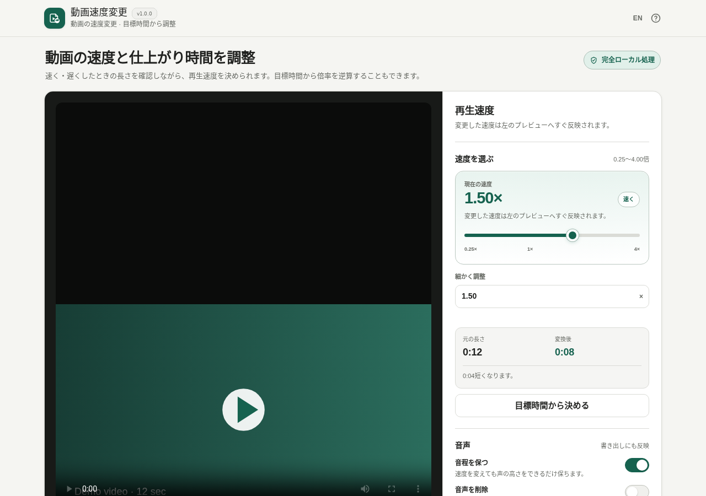

# Video Speed Changer / 動画速度変更

[](https://github.com/ttomohisa/htmlapps-video-speed-changer/actions/workflows/deploy-pages.yml)
[](LICENSE)
[](https://ttomohisa.github.io/htmlapps-video-speed-changer/)

[English README](README.md)

動画を0.25〜4.00倍で速く・遅くし、変換後の長さを事前に確認しながらMP4として保存できる、ブラウザー完結型の単一HTMLアプリです。選択した動画をサーバーへアップロードせずに処理します。

## 🚀 デモ

### [GitHub PagesでVideo Speed Changerを開く](https://ttomohisa.github.io/htmlapps-video-speed-changer/)

GitHub Pagesから最初のHTMLを読み込んだ後、動画情報の確認、速度プレビュー、変換、変換結果のプレビュー、保存はブラウザー内で処理されます。選択した動画をこのアプリがサーバーへアップロードすることはありません。

[](https://ttomohisa.github.io/htmlapps-video-speed-changer/)

## 主な機能

- **0.25〜4.00倍で速度変更** — スライダーまたは数値入力で倍率を指定し、変換後の長さをすぐ確認できます。
- **目標時間から倍率を逆算** — 仕上げたい長さを入力すると、対応範囲内で必要な速度を計算します。
- **変換前後をプレビュー** — まず元動画で速度感を確認し、変換後のMP4も保存前に再生できます。
- **音声の扱いを選択** — 音程を保つ、速度に合わせて音程も変える、音声を削除する、の3通りに対応します。
- **基本的な出力調整** — 高画質／標準／ファイルを小さく、から画質を選び、保存ファイル名も変更できます。
- **変換キャンセルに対応** — 変換を止めても選択動画と設定は残ります。再変換をキャンセルした場合は前の変換結果を保持します。
- **完全ローカル処理の単一HTML** — FFmpeg JS/WASMとWorker runtimeを生成HTMLへ内包し、日本語／英語UIを実行時の外部アップロードなしで利用できます。

## すぐに使う

### Webで使う

[デモを開く](https://ttomohisa.github.io/htmlapps-video-speed-changer/)だけで利用できます。インストールやアカウント登録は不要です。

### 単一HTMLをビルドして使う

1. Windowsでこのリポジトリをダウンロードまたはクローンします。
2. `build-standalone.bat` をダブルクリックします。
3. 初回ビルド時だけ、`ffmpeg.release.lock.json` で固定したFFmpeg WASM Builder v1.8.1のRelease Assetを取得します。
4. AssetのSHA-256と埋め込み対象のFFmpegファイルを検証してからHTMLを生成します。
5. 生成された `dist/index.html` を任意の場所へコピーし、その1ファイルを後から直接開けます。

ビルドにPython、Node.js、ローカルWebサーバーは不要です。Windows PowerShellを使用し、固定済みRelease Assetがキャッシュにない場合だけ取得します。

## 使い方

1. 動画を選択するか、画面へドラッグ＆ドロップします。
2. スライダーまたは数値入力で `0.25×`〜`4.00×` の速度を指定します。
3. 必要なら **目標時間から決める** を開き、仕上げたい動画の長さを入力します。
4. 音声を **音程を保つ／音程も変える／削除** から選びます。
5. 必要に応じて **詳細設定** から画質を変更します。
6. ファイル名を確認して **この設定で動画を変換** を選びます。
7. 変換結果をプレビューし、長さとファイルサイズを確認して **MP4を保存** を選びます。

### ブラウザーでプレビューできない場合

通常はブラウザー標準の動画機能でプレビューと動画情報を取得します。そこで読み込めなくても、内蔵したFFmpegで動画情報を読めた場合は、プレビューなしで変換を試せます。ただし、すべての動画形式や壊れたファイルの変換を保証するものではありません。

### 変換をキャンセルする

処理中に **変換をキャンセル** を選ぶと、実行中のFFmpeg Workerを停止します。選択した動画と現在の設定は残ります。すでに変換結果がある状態で再変換をキャンセルした場合、新しい変換が成功するまでは前の結果を保存できます。

## GitHub Pagesで公開する

このリポジトリには、固定済みFFmpeg Releaseから単一HTMLを再生成し、`dist/` をGitHub Pagesへ公開するワークフローが含まれています。

1. リポジトリ名を `htmlapps-video-speed-changer` としてGitHubへプッシュします。
2. **Settings → Pages → Build and deployment → Source** で **GitHub Actions** を選択します。
3. `main` へプッシュするか、Actions画面から **Deploy standalone app to GitHub Pages** を手動実行します。
4. ビルド成功後、`https://ttomohisa.github.io/htmlapps-video-speed-changer/` で公開されます。

`main` のビルドでは、固定Release Asset、単一HTML、self-extract版、CSP、埋め込みfavicon、manifest、Release provenanceを検証してから公開します。

## 開発とビルド

```text
.
├─ src/index.template.html          # アプリ本体テンプレート
├─ ffmpeg.release.json              # 使用するBuilder Release/profile
├─ ffmpeg.release.lock.json         # Release/Asset ID・サイズ・SHA-256固定値
├─ build-standalone.bat             # 通常の固定Releaseビルド入口
├─ build-with-local-ffmpeg.bat      # Builder開発時だけ使うローカル取り込み
├─ scripts/import-release-ffmpeg.ps1
├─ scripts/check-release-artifacts.ps1
├─ dist/index.html                  # 生成される読みやすい単一HTML
├─ dist/index.self-extract.html     # 生成されるself-extract版
└─ .github/workflows/
   ├─ build-standalone.yml          # Pull Request時のビルド検証
   └─ deploy-pages.yml              # mainからPagesへ自動公開
```

### FFmpeg runtimeを更新する

通常ビルドで `latest` は参照しません。`ffmpeg.release.lock.json` に、使用するtag・Asset名・byte数・SHA-256を固定します。

将来Builderを意図的に更新するときは、次の順で進めます。

1. `ffmpeg.release.json` を変更します。
2. `pin-ffmpeg-release.bat` を1回実行します。
3. 解決されたRelease/Asset情報とSHA-256 lockを確認します。
4. Builder側のprofile smoke testが通ったことを確認してからlockをコミットします。
5. `build-standalone.bat` を再実行し、リリース回帰を行います。

Builder自体を開発しているときだけ、次のローカル取り込みを使えます。

```bat
build-with-local-ffmpeg.bat "C:\path\to\htmlapps-ffmpeg-wasm-builder"
```

この経路は `local-builder` provenanceとして記録され、正式リリース成果物の検証では受け付けません。

## プライバシーと実行時通信

生成されたアプリは、HTMLを読み込んだ後の処理を完全ローカルで行う設計です。

- 選択した動画をこのアプリからアップロードしません。
- FFmpeg JS/WASMとWorker runtimeは最終HTMLへ内包します。
- CSPは `connect-src 'none'` を維持します。
- 実行時CDN、Analytics、Telemetry、外部フォント、自動更新確認はありません。
- BuilderのGitHub Releaseへアクセスするのはビルド時だけです。
- 正式ビルドでは `ffmpeg-wasm-video-speed-changer-v1.8.1.zip` をコミット済みSHA-256で検証してから埋め込みます。

GitHub Pages版では最初のHTML配信は発生します。ネットワークを完全に切って利用する場合は、事前にビルドした `dist/index.html` を `file://` で直接開いてください。

## 対応ブラウザー

主な対象はChromeとEdgeです。ブラウザー標準の動画再生機能に加え、変換にはWebAssembly、Web Worker、Blob URL、`DecompressionStream` などの比較的新しいWeb APIを使用します。他の最新ブラウザーでも動作する場合がありますが、動画Codec対応や利用可能なメモリ量はブラウザーごとに異なります。

## 制限事項

- 速度変更の対応範囲は `0.25×`〜`4.00×` です。
- 出力は専用FFmpeg/x264 profileによるMP4です。汎用の動画編集アプリではありません。
- v1.0.0ではトリミング、クロップ、字幕、トランジション、速度ランプは扱いません。
- 長時間・高解像度・大容量動画では、端末やブラウザーのメモリ上限に達する場合があります。
- ブラウザーで直接プレビューできなくても変換を試せる場合がありますが、すべてのCodecを保証するものではありません。
- 音程維持を含め、ブラウザーの速度プレビューと最終的な変換結果にはわずかな差が出る場合があります。

## 使用コンポーネント

| コンポーネント | バージョン | ライセンス | 用途 |
| --- | ---: | --- | --- |
| FFmpeg / x264 WASM core | FFmpeg WASM Builder v1.8.1 `video-speed-changer` profile | GPL-2.0-or-later | 動画・音声変換、動画情報確認 |

アプリ本体のソースコードはMIT Licenseです。生成するFFmpeg/x264バイナリにはGPL-2.0-or-laterのライセンス条件が適用されます。対応ソースと固定Releaseの関係を含む詳細は [THIRD_PARTY_NOTICES.md](THIRD_PARTY_NOTICES.md) を確認してください。

## コントリビューション

バグ報告や機能提案はGitHub Issuesからお願いします。開発への参加方法は [CONTRIBUTING.md](CONTRIBUTING.md) を確認してください。

## ライセンス

Copyright © 2026 ttomohisa

このプロジェクトは [MIT License](LICENSE) で公開されています。
