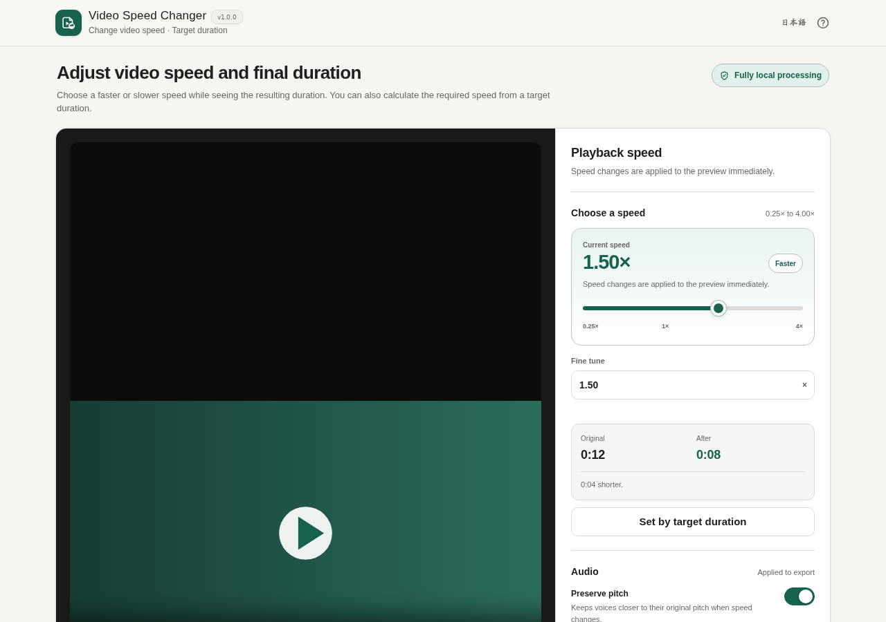

# Video Speed Changer

[](https://github.com/ttomohisa/htmlapps-video-speed-changer/actions/workflows/deploy-pages.yml)
[](LICENSE)
[](https://ttomohisa.github.io/htmlapps-video-speed-changer/)

[日本語版 README](README.ja.md)

A browser-only, single-HTML app for changing video speed from 0.25× to 4.00×, checking the resulting duration before conversion, and saving the result as MP4 without uploading the selected video to a server.

## 🚀 Live demo

### [Open Video Speed Changer on GitHub Pages](https://ttomohisa.github.io/htmlapps-video-speed-changer/)

GitHub Pages delivers the initial HTML. After it loads, video inspection, speed preview, conversion, result preview, and saving are processed locally in the browser. The video you select is not uploaded by the app.

[](https://ttomohisa.github.io/htmlapps-video-speed-changer/)

## Features

- **Change speed from 0.25× to 4.00×** — Use the slider or enter a precise multiplier and see the resulting duration immediately.
- **Set speed from a target duration** — Enter the desired final length and let the app calculate the required speed when it falls within the supported range.
- **Preview before and after conversion** — Check the selected playback speed first, then preview the converted MP4 before saving it.
- **Choose how audio behaves** — Preserve pitch, let pitch change with speed, or remove audio from the output.
- **Control basic output quality** — Choose High quality, Standard, or Smaller file and edit the output filename before conversion.
- **Cancel and recover safely** — Cancel an active conversion without losing the selected video or settings; cancelling a reconversion keeps the previous result available.
- **Fully local single-HTML runtime** — FFmpeg JS/WASM and its Worker runtime are embedded in the generated HTML, with Japanese/English UI and no runtime upload of selected videos.

## Quick start

### Use the web demo

Just [open the demo](https://ttomohisa.github.io/htmlapps-video-speed-changer/). No installation or account is required.

### Build a standalone file

1. Download or clone this repository on Windows.
2. Double-click `build-standalone.bat`.
3. The first build downloads the exact FFmpeg WASM Builder v1.8.1 Release Asset pinned in `ffmpeg.release.lock.json`.
4. The asset SHA-256 and embedded FFmpeg files are verified before the app is generated.
5. Copy `dist/index.html` wherever you need it and open that single file later.

Python, Node.js, and a local web server are not required for the build. The build uses Windows PowerShell and downloads the pinned release asset only when it is not already cached.

## Usage

1. Choose a video, or drag and drop one onto the page.
2. Use the speed slider or enter a value from `0.25×` to `4.00×`.
3. Optionally choose **Set by target duration** and enter the desired final length.
4. Choose the audio behavior: preserve pitch, shift pitch with speed, or remove audio.
5. Open **Advanced settings** if you want to change output quality.
6. Check the output filename and choose **Convert with these settings**.
7. Preview the converted result, compare its duration and file size, then choose **Save MP4**.

### When browser preview is unavailable

The app first uses the browser's native video support for preview and metadata. If that fails but the embedded FFmpeg runtime can read the file, the app shows the media information and still lets you try converting it. This does not guarantee support for every codec or malformed file.

### Cancelling conversion

Choose **Cancel conversion** while processing to stop the active FFmpeg Worker. The selected video and current settings remain available. If you cancel a reconversion after already creating a result, the previous result stays available until a new conversion succeeds or you replace the source video.

## Publish with GitHub Pages

The repository includes a workflow that rebuilds the standalone HTML from the pinned FFmpeg release and deploys `dist/` to GitHub Pages.

1. Push the repository to GitHub as `htmlapps-video-speed-changer`.
2. Open **Settings → Pages → Build and deployment → Source** and select **GitHub Actions**.
3. Push to `main`, or manually run **Deploy standalone app to GitHub Pages** from the Actions tab.
4. After a successful deployment, the demo is available at `https://ttomohisa.github.io/htmlapps-video-speed-changer/`.

Each `main` build verifies the pinned release asset, standalone HTML, self-extract variant, CSP, embedded favicon, dependency manifests, and release provenance before deployment.

## Development and build layout

```text
.
├─ src/index.template.html          # Application template
├─ ffmpeg.release.json              # Intended Builder release/profile
├─ ffmpeg.release.lock.json         # Release/asset IDs, size, and SHA-256 lock
├─ build-standalone.bat             # Normal pinned-release build entry point
├─ build-with-local-ffmpeg.bat      # Builder-development-only import path
├─ scripts/import-release-ffmpeg.ps1
├─ scripts/check-release-artifacts.ps1
├─ dist/index.html                  # Generated readable single HTML
├─ dist/index.self-extract.html     # Generated compact self-extract variant
└─ .github/workflows/
   ├─ build-standalone.yml          # Pull request build validation
   └─ deploy-pages.yml              # Automatic Pages deployment from main
```

### Update the FFmpeg runtime

Do not point normal builds at `latest`. Release builds use the exact tag, asset name, byte count, and SHA-256 committed in `ffmpeg.release.lock.json`.

When intentionally moving to a future Builder release:

1. Update `ffmpeg.release.json`.
2. Run `pin-ffmpeg-release.bat` once.
3. Review the resolved release/asset metadata and generated SHA-256 lock.
4. Commit the updated lock only after the Builder profile smoke tests have passed.
5. Run `build-standalone.bat` again and complete the release regression.

For active Builder development only, you can use:

```bat
build-with-local-ffmpeg.bat "C:\path\to\htmlapps-ffmpeg-wasm-builder"
```

That path records `local-builder` provenance and is intentionally rejected by stable release-artifact verification.

## Privacy and runtime network protection

The generated application is designed for fully local processing after the HTML itself has loaded.

- The selected video is not uploaded by the app.
- The final HTML contains the FFmpeg JS/WASM core and Worker runtime.
- Runtime CSP includes `connect-src 'none'`.
- There is no runtime CDN, analytics, telemetry, external font, or update check.
- The Builder GitHub Release is contacted only at build time.
- Release builds verify `ffmpeg-wasm-video-speed-changer-v1.8.1.zip` against the committed SHA-256 before embedding it.

The GitHub Pages version still needs the initial HTML request. To use the tool with the network fully disconnected, build the repository first and open `dist/index.html` locally with `file://`.

## Browser support

Chrome and Edge are the primary targets. The app depends on browser video-decoder support for native preview and on modern Web APIs such as WebAssembly, Web Workers, Blob URLs, and `DecompressionStream` for the embedded conversion runtime. Other current browsers may work, but codec support and available memory can differ.

## Limitations

- The supported speed range is `0.25×` to `4.00×`.
- Output is MP4 using the dedicated FFmpeg/x264 conversion profile; this is not a general-purpose video editor.
- Trimming, cropping, subtitles, transitions, and speed ramps are not included in v1.0.0.
- Very large or high-resolution videos can exceed browser/device memory limits.
- A video that cannot be previewed natively may still be convertible through FFmpeg inspection, but every codec is not guaranteed to work.
- Browser preview and final export can differ slightly, especially when pitch preservation is involved.

## Dependencies

| Component | Version | License | Purpose |
| --- | ---: | --- | --- |
| FFmpeg / x264 WASM core | FFmpeg WASM Builder v1.8.1 `video-speed-changer` profile | GPL-2.0-or-later | Video/audio conversion and media inspection |

The application source is MIT licensed. The generated FFmpeg/x264 binary keeps its own GPL-2.0-or-later licensing requirements. See [THIRD_PARTY_NOTICES.md](THIRD_PARTY_NOTICES.md) for details and the pinned corresponding-source relationship.

## Contributing

Bug reports and feature proposals are welcome through GitHub Issues. See [CONTRIBUTING.md](CONTRIBUTING.md) for development guidance.

## License

Copyright © 2026 ttomohisa

Licensed under the [MIT License](LICENSE).
